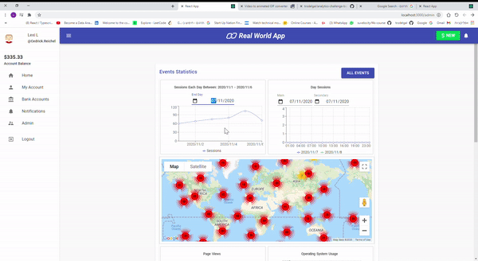

# My Work
## server
### Work On `event-routes.ts` File
- server work with express and database with lowDB.
#### End Points:
- `/all` - Return all the events from DB. 
- `/all-filtered` - Return all the events from DB filtered by type, browser and search text. Option to limit the numbers of the events and sort them by event date. 
- `/by-days/:offset` - Return count of unique sessions (events with different session_id), grouped by days, for one week. 
`Offset` is the number of days to go back from today and start count week back from this day.
- `/by-hours/:offset` - Return count of unique sessions (events with different session_id), grouped by hour, for one day.
`Offset` is the number of days to go back from today and count this day events.
- `/retention` - Get a "dayZero" query Parameter which denotes the day, as milliseconds, to start calculating from. Return the an array of objects with User retention Information for every week since dayZero. For every week, what percent of the users that signed up on that week have logged in to the site on every consecutive week. 
- `/today` - Return all the event that happened today.
- `/week` - Return all the event that happened this week.
- `/:eventId` - Return the event with the ID that transferred.
- `POST` `/` - Create new event.

#### DB queries functions on `database.ts` file.

## client
### Main Work In `/src/components/tiles` Folder.
#### Admin Events Statistics Page (`/src/container/DashBoard.tsx`) With 6 Tiles (only Admin users can can watch it):
- `Week Sessions`- Showing line graph with unique sessions by day with option to change date. 

- `Day Sessions`- Showing line graph with unique sessions by hour with option to change date, and compare between 2 date.

- `Events Location Map`- Showing events on World Map.

- `Page Views`- Showing pie graph with page views for on each page.

- `Operating System Usage`- Showing Bar charts with operating system usage.

- `Retention Cohort`- Showing retention cohort week by week, with option to change the week of start counting.

#### All Events Page (`/src/container/AllEvents.tsx`):
- Show all the events in table.
- Filter bar by type, browser and search text. 
- Sort by date option.
- Show only 10 events, and load more only when the client scrolls down the table.

## GIF:

## Getting Started
  
use `npm run init` __in the project root__ to download both the client and server dependencies, or :   
- Setup server  
    1. `cd server`  
    3. `npm i` 
    3. `npm start` in `/server`
    4. `npm run test` - runs backend tests
- Setup client  
    1. `cd client`  
    3. `npm i` 
    3. `npm start` in `/client`. this can take a while
- After installing all dependencies, you can also use `npm run dev` in in either folder to run both concurrently.

- Note: do not delete the root folder's package.json, it is necessary.

#### Libraries:
- muterial UI.
- recharts.
- Stayled components.
- @react-google-maps/api.
- axios.
- react-dom.

